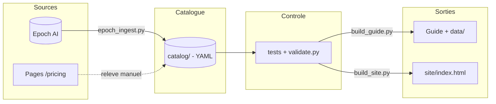

# Tandem

**Modèles et harnais mesurés ensemble — parce qu'un score n'appartient jamais à un modèle seul.**


Référentiel ouvert de l'offre de développement assisté par IA, construit pour résister
à la vérification. Son nom dit sa thèse : un score n'est pas un attribut d'un modèle,
mais du triplet *(modèle × harnais × effort de raisonnement)*. Le catalogue recense
**52 harnais distincts** sur le seul Terminal-Bench, et l'écart qu'ils produisent dépasse
souvent l'écart entre deux modèles concurrents. Ce dépôt rend cet attelage visible plutôt
que de le masquer derrière un classement.

## Sommaire

- [Architecture](#architecture)
- [Documentation](#documentation)
- [Démarrage](#démarrage)
- [Configuration](#configuration)
- [Tests](#tests)
- [État de vérification](#état-de-vérification)
- [Ce que le référentiel n'affirme pas](#ce-que-le-référentiel-naffirme-pas)
- [Structure du projet](#structure-du-projet)
- [Licences & composants](#licences--composants)

## Architecture

`catalog/` est la **seule source de vérité** ; le Guide Markdown, les fiches `data/` et
la page `site/index.html` en sont générés. Deux portes contrôlent la publication : les
tests du pipeline, puis le validateur de la donnée.



> Détails : [docs/ARCHITECTURE.md](docs/ARCHITECTURE.md)

## Documentation

| Document | Contenu |
|---|---|
| [docs/CADRAGE.md](docs/CADRAGE.md) | Le POURQUOI : objectifs, périmètre, hypothèses, décisions, roadmap |
| [docs/ARCHITECTURE.md](docs/ARCHITECTURE.md) | Le COMMENT : composants, modèle de données, contrôles, flux |
| [protocol/06_protocole_operatoire.md](protocol/06_protocole_operatoire.md) | Runbook de mise à jour, applicable par tout agent |
| [protocol/04_sources_et_collecte.md](protocol/04_sources_et_collecte.md) | Où trouver la donnée, hiérarchie de provenance |
| [protocol/05_methodologie_benchmarks.md](protocol/05_methodologie_benchmarks.md) | Comment lire et publier un score |
| [AGENTS.md](AGENTS.md) | Point d'entrée pour les agents non-Claude |
| [Guide complet](Guide_Complet_Solutions_Dev_IA_2026.md) | Livrable généré : tableaux comparatifs |

## Démarrage

**Prérequis** : Python ≥ 3.12.

```bash
pip install -r requirements.txt
cp .env.example .env        # optionnel : uniquement pour le recoupement tarifaire
```

Le point d'entrée de toute mise à jour est le plan de travail : il dit ce qui est à
vérifier maintenant, trié par impact, avec l'URL à ouvrir et les pièges d'accès déjà
rencontrés pour chaque fournisseur.

```bash
python3 pipeline/worklist.py
```

| Commande | Rôle |
|---|---|
| `python3 pipeline/worklist.py` | Plan de travail — **commencer ici** |
| `python3 pipeline/epoch_ingest.py --force-download` | Rafraîchit les benchmarks |
| `python3 pipeline/seed_catalog.py` | Détecte les nouveaux modèles mesurés |
| `python3 pipeline/apply_pricing.py` | Injecte les tarifs relevés à la main |
| `python3 pipeline/crosscheck_aa.py` | Recoupe avec une seconde source |
| `python3 pipeline/validate.py` | Contrôle qualité — code 1 si erreur bloquante |
| `python3 pipeline/build_guide.py` | Régénère le Guide et les fiches `data/` |
| `python3 pipeline/build_site.py` | Régénère la page interactive |
| `python3 pipeline/changelog.py` | Diff avec l'édition précédente |

## Configuration

Les paramètres globaux vivent dans [catalog/_meta.yaml](catalog/_meta.yaml) et
commandent tout le reste : modifiés là, ils se propagent à chaque génération.

| Paramètre | Valeur | Effet |
|---|---|---|
| `fx.usd_eur` | `0.8666` | Taux de conversion. **Aucune valeur en euros ne se saisit à la main** |
| `vat.rate` | `0.20` | TVA française, appliquée au calcul du TTC particulier |
| `freshness.warn_after_days` | `90` | Au-delà, une donnée est signalée à re-vérifier |
| `freshness.stale_after_days` | `180` | Au-delà, elle est considérée périmée et bloque |
| `provenance_ranking` | 7 niveaux | Arbitre les contradictions entre sources |

| Variable d'environnement | Défaut | Effet |
|---|---|---|
| `AA_API_KEY` | vide | Active le recoupement Artificial Analysis. Sans elle, le script explique et sort proprement |

## Tests

```bash
python3 -m unittest discover -s tests -v
```

42 tests sur les invariants du protocole. Ils tournent en CI à chaque push, avant le
validateur, avec un contrôle que les sorties générées n'ont pas divergé du catalogue.

## État de vérification

Chaque chiffre publié porte sa source. Le tableau dit d'où vient la donnée, pas ce qu'il
resterait à faire — le plan de travail s'en charge.

| Couche | Couverture | Source |
|---|---|---|
| Benchmarks | 1 275 mesures, 18 classements | Epoch AI, jeu de données daté |
| dont coût réellement mesuré | 278 mesures | même source, colonne de coût d'exécution |
| dont effort de raisonnement connu | 510 mesures | même source, colonne de protocole |
| Modèles | 207, 11 fournisseurs | identités issues des mesures, jamais inventées |
| Tarifs API | 73 tarifs relevés, couvrant 132 modèles · 75 sans tarif éditeur | page tarifaire officielle de chaque fournisseur |
| Forfaits d'abonnement | 29 paliers, 9 éditeurs | page tarifaire officielle |
| Harnais et passerelles | 30 fiches, toutes contrôlées | documentation ou tarifs de l'éditeur |
| Balayage des fournisseurs | 11 sur 11 | recherche outil par outil, y compris les absences |
| Taux de change | 1 EUR = 1,1539 USD | taux de référence BCE du 15/09/2026 |

**« Sans tarif éditeur » n'est pas un trou.** 75 modèles n'auront jamais de ligne
tarifaire : poids ouverts facturés par l'hébergeur qui les sert, générations retirées de
la grille, identifiants de passerelle, pré-versions jamais commercialisées. Chacun porte
son motif dans [catalog/pricing_verified.yaml](catalog/pricing_verified.yaml). Les
confondre avec les tarifs à relever ferait paraître le catalogue incomplet à perpétuité.

Deux chantiers restent ouverts, et le plan de travail les rappelle à chaque exécution :

| Chantier | État | Ce qui bloque |
|---|---|---|
| Conformité des harnais | 6 fiches sur 30 | rétention, résidence, SSO, audit — un relevé par éditeur |
| Recoupement des benchmarks | implémenté, inactif | `AA_API_KEY` non configurée ; sans elle, tout vient d'Epoch AI seul |

## Ce que le référentiel n'affirme pas

- **Aucun classement de « meilleur modèle »** : la question est mal posée.
- **Aucun score composite maison** : agréger des protocoles différents produit un nombre
  sans signification.
- **Aucune interpolation** : un modèle non mesuré reste vide, et la vue « Couverture »
  affiche les trous en pointillés.
- Le validateur **interdit de titrer sur un vainqueur** quand les deux premiers d'un
  classement ne sont pas séparés statistiquement — c'est actuellement le cas sur
  SWE-bench Verified.
- **Le coût par tâche de benchmark n'est pas le coût d'une journée de développement.**
- Rien sur la latence perçue, l'ergonomie du harnais ni la qualité durable du code produit.

## Structure du projet

```text
tandem-ai/
├── catalog/                 # SOURCE DE VÉRITÉ — seul endroit édité à la main
│   ├── _meta.yaml           #   taux, TVA, seuils, hiérarchie de provenance
│   ├── pricing_verified.yaml#   tarifs saisis + modèles sans tarif éditeur API
│   ├── plans.yaml           #   forfaits d'abonnement
│   ├── tools.yaml           #   harnais + conformité
│   ├── labs.yaml            #   fournisseurs + balayage outillage
│   ├── models.yaml          #   modèles + tarifs fusionnés
│   ├── benchmarks.yaml      #   registre raisonné              (généré)
│   └── scores.yaml          #   mesures                        (généré)
├── pipeline/                # ingestion, validation, génération, recoupement
├── tests/                   # 42 tests des invariants du protocole
├── protocol/                # méthodologie — fait autorité
├── content/                 # fragments narratifs du Guide (écrits à la main)
├── docs/                    # cadrage et architecture
├── snapshots/               # instantanés datés, base des changelogs
├── data/                    # fiches par catégorie             (généré)
├── site/index.html          # page interactive                 (généré)
└── Guide_Complet_Solutions_Dev_IA_2026.md                      # (généré)
```

## Licences & composants

| Composant | Rôle | Licence |
|---|---|---|
| Python 3.12 | Langage | PSF |
| PyYAML 6.0.1 | Sérialisation du catalogue | MIT |
| Epoch AI — *Capabilities & Benchmarking* | Données de benchmark | CC BY 4.0 |
| Artificial Analysis Data API | Recoupement tarifaire optionnel | Attribution requise |
| **Ce projet** | Code du pipeline — [LICENSE](LICENSE) | MIT — Copyright (c) 2026 floSa |
| **Ce projet** | Méthodologie, curation, documentation — [LICENSE-CONTENT](LICENSE-CONTENT) | CC BY 4.0 |

Le code est sous **MIT**. Le contenu documentaire et la curation sont sous **CC BY 4.0**,
par compatibilité avec les données d'[Epoch AI](https://epoch.ai/benchmarks) dont ils
dérivent : l'attribution est obligatoire dans toute republication. Attributions
complètes : [ATTRIBUTION.md](ATTRIBUTION.md).
