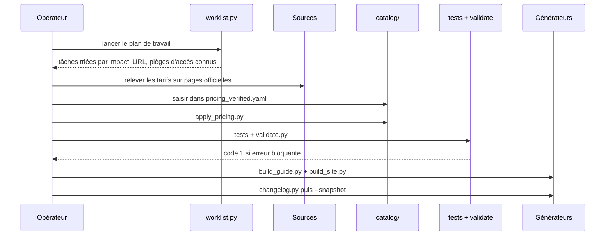

# Architecture — Observatoire Dev IA

Le COMMENT. Le POURQUOI est dans [CADRAGE.md](CADRAGE.md) ; le protocole opératoire
de mise à jour est dans [protocol/06_protocole_operatoire.md](../protocol/06_protocole_operatoire.md).

---

## 1. Principe structurant

Le dépôt applique une règle unique : **`catalog/` est la seule source de vérité, tout
le reste en dérive**. Le Guide Markdown, les fiches `data/` et la page `site/index.html`
sont générés ; les corriger à la main est sans effet, le build suivant les écrase.

Cette contrainte n'est pas cosmétique. Avant sa mise en place, les mêmes chiffres
vivaient dans deux fichiers Markdown distincts et divergeaient à chaque édition. La CI
échoue désormais si une sortie générée n'a pas été régénérée après modification du
catalogue.

```mermaid
flowchart TB
  subgraph Sources["Sources externes"]
    epoch[(Epoch AI<br/>benchmark_data.zip)]
    pages[Pages /pricing<br/>officielles]
    aa[(Artificial Analysis<br/>API v2)]
  end

  subgraph Saisie["Saisie manuelle"]
    pv[pricing_verified.yaml]
    pl[plans.yaml]
    tl[tools.yaml]
    mt[_meta.yaml]
  end

  subgraph Catalogue["catalog/ - source de verite"]
    sc[scores.yaml]
    bm[benchmarks.yaml]
    md[models.yaml]
    lb[labs.yaml]
  end

  subgraph Controle["Portes de sortie"]
    ts[tests/ - 34 tests]
    vl[validate.py]
  end

  subgraph Sorties["Sorties generees"]
    gd[Guide Markdown]
    df[data/ - 6 fiches]
    st[site/index.html]
    cl[CHANGELOG date]
  end

  epoch -->|epoch_ingest.py| sc
  epoch -->|epoch_ingest.py| bm
  sc -->|seed_catalog.py| md
  pages -.releve manuel.-> pv
  pv -->|apply_pricing.py| md
  aa -.crosscheck_aa.py<br/>signale, n ecrit pas.-> md
  mt --> vl
  pl --> vl
  tl --> vl
  md --> vl
  sc --> vl
  ts --> vl
  vl -->|build_guide.py| gd
  vl -->|build_guide.py| df
  vl -->|build_site.py| st
  vl -->|changelog.py| cl
```

---

## 2. Composants

| Couche | Fichier | Rôle |
|---|---|---|
| Ingestion | [pipeline/epoch_ingest.py](../pipeline/epoch_ingest.py) | Télécharge l'export Epoch AI, construit le registre des benchmarks et les scores |
| Ingestion | [pipeline/seed_catalog.py](../pipeline/seed_catalog.py) | Dérive labs et modèles des identités réellement mesurées |
| Ingestion | [pipeline/apply_pricing.py](../pipeline/apply_pricing.py) | Fusionne les tarifs relevés à la main, avec leur provenance |
| Contrôle | [pipeline/validate.py](../pipeline/validate.py) | Six familles de contrôles, sortie en code 1 si erreur bloquante |
| Contrôle | [pipeline/crosscheck_aa.py](../pipeline/crosscheck_aa.py) | Confronte les tarifs à une seconde source. N'écrit jamais |
| Contrôle | [tests/test_pipeline.py](../tests/test_pipeline.py) | 34 tests sur les invariants du protocole |
| Pilotage | [pipeline/worklist.py](../pipeline/worklist.py) | Plan de travail : ce qui est à vérifier, trié par impact |
| Génération | [pipeline/build_guide.py](../pipeline/build_guide.py) | Guide Markdown + 6 fiches `data/` |
| Génération | [pipeline/build_site.py](../pipeline/build_site.py) | Page HTML autonome, données embarquées |
| Génération | [pipeline/changelog.py](../pipeline/changelog.py) | Diff contre l'instantané de l'édition précédente |

---

## 3. Le catalogue

| Fichier | Nature | Contenu |
|---|---|---|
| [_meta.yaml](../catalog/_meta.yaml) | Manuel | Taux de change, TVA, seuils de fraîcheur, hiérarchie de provenance |
| [pricing_verified.yaml](../catalog/pricing_verified.yaml) | Manuel | **Seul endroit où l'on saisit un tarif API** |
| [plans.yaml](../catalog/plans.yaml) | Manuel | Forfaits d'abonnement SaaS |
| [tools.yaml](../catalog/tools.yaml) | Manuel | Harnais, statut de vérification, conformité |
| [labs.yaml](../catalog/labs.yaml) | Généré puis enrichi | Fournisseurs et URL de tarification |
| [models.yaml](../catalog/models.yaml) | Généré puis enrichi | Modèles, tarifs fusionnés |
| [benchmarks.yaml](../catalog/benchmarks.yaml) | **Généré** | Registre raisonné, avec les rejets motivés |
| [scores.yaml](../catalog/scores.yaml) | **Généré** | Une entrée par mesure |

Éditer `benchmarks.yaml` ou `scores.yaml` est inutile : la curation se pilote par les
dictionnaires `CURATION` et `REJECTED` de [epoch_ingest.py](../pipeline/epoch_ingest.py).

### Modèle de données d'une mesure

Une mesure n'est pas un couple (modèle, score). Elle porte son contexte complet, faute
de quoi elle n'est comparable à rien :

| Champ | Rôle |
|---|---|
| `model_version` / `model_base` | Identité, avec et sans suffixe d'effort |
| `effort` | Budget de raisonnement : `minimal` à `max` |
| `harness` | Le harnais qui exécutait le modèle |
| `protocol` | Pass@k, budget d'étapes, outils autorisés |
| `score` / `stderr` | Valeur normalisée en fraction, et son incertitude |
| `cost_usd` | Coût **réellement dépensé** pendant le run |
| `provenance` | Niveau dans la hiérarchie de confiance |
| `source_url` / `evidence_url` | Source amont et logs reproductibles |

---

## 4. Décisions techniques

**Catalogue YAML plutôt que base de données**, parce que le dépôt est destiné à être
publié et relu : un diff Git sur du YAML se lit, un dump SQL non. **Limite** : aucune
requête complexe possible, et `scores.yaml` atteint déjà 636 Ko.

**Génération des sorties plutôt que rédaction directe**, parce que la duplication entre
`data/` et le Guide produisait une divergence à chaque édition. **Limite** : le narratif
doit vivre à part, dans [content/](../content/), ce qui ajoute une indirection.

**Page HTML autonome sans dépendance externe** (SVG et JavaScript écrits à la main)
plutôt qu'une bibliothèque de graphiques, parce que la page doit fonctionner sur GitHub
Pages, en artifact et hors ligne, sans politique de sécurité de contenu à négocier.
**Limite** : chaque type de graphique est du code à écrire et à maintenir.

**Le recoupement signale mais n'écrit pas.** Une contradiction entre deux sources
s'arbitre selon la hiérarchie de provenance — une page officielle prime sur un
agrégateur — et cet arbitrage demande un jugement. **Limite** : le recoupement ne se
fait pas tout seul.

**Un outil disparu passe en `retired`, il n'est pas supprimé**, parce qu'une disparition
est une information d'audit. **Limite** : le catalogue s'allonge indéfiniment.

---

## 5. Les six familles de contrôle

[validate.py](../pipeline/validate.py) sort en code 1 dès qu'une erreur bloquante est
détectée, ce qui le rend utilisable tel quel en CI.

| Famille | Ce qu'elle vérifie |
|---|---|
| Référentiel | Intégrité des références croisées entre fichiers |
| Provenance | Tout chiffre publié porte source, date et niveau de confiance |
| Fraîcheur | Aucune donnée ne dépasse silencieusement sa péremption |
| Cohérence | Contrôles arithmétiques sur les tarifs |
| Comparabilité | Détection des scores non comparables entre eux |
| Couverture | Trous de mesure, benchmarks saturés, décalage marché/mesure |

Le contrôle de comparabilité applique un test statistique : quand l'écart entre les deux
premiers d'un classement est inférieur à l'intervalle de confiance combiné à 95 %, il
interdit de titrer sur un vainqueur. C'est le cas actuel sur SWE-bench Verified.

---

## 6. Sécurité et données

| Point | État |
|---|---|
| Secrets dans le dépôt | Aucun. `.env` est ignoré par Git |
| Clé d'API requise | Aucune pour le fonctionnement nominal. `AA_API_KEY` uniquement pour le recoupement optionnel |
| Données brutes téléchargées | `sources/raw/`, non versionné |
| Données personnelles traitées | Aucune |
| Appels réseau sortants | Epoch AI, pages `/pricing` publiques, Artificial Analysis si configuré |

Le seul risque de fuite serait une clé d'API commitée par inadvertance ;
[.gitignore](../.gitignore) couvre `.env`, les archives et les JSON de `sources/raw/`.

---

## 7. Flux d'une édition



L'instantané se fige **après** publication : il sert de base de comparaison à l'édition
suivante.
